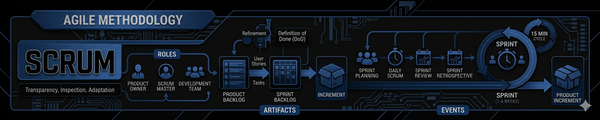

<h1 align=center>SCRUM</h1>

<h2 align=center>O Scrum é uma estrutura de gerenciamento (framework) leve, baseada em princípios ágeis, que ajuda equipes a lidar com problemas complexos e adaptáveis enquanto entregam produtos de alto valor de forma criativa e produtiva</h2>

<b>Objetivos</b>
   Gerenciar projetos complexos, aumentar a produtividade, permitir a adaptação rápida a mudanças e garantir a entrega contínua de valor ao cliente.

<h3 align=center>PRINCIPAIS PAPÉIS</h3>

<b>Product Owner:</b> É o ponto central da estratégia. Ele define quais funcionalidades devem ser criadas e prioriza o Product Backlog para maximizar o valor do trabalho realizado.

<b>Scrum Master:</b> Atua como um líder servidor e coach para a equipe e a organização. Seu foco é garantir que o Scrum seja compreendido e aplicado, removendo impedimentos que atrapalhem o progresso do time.

<b>Development Team:</b> Profissionais multidisciplinares e autogerenciáveis responsáveis por realizar o trabalho técnico e transformar itens do backlog em incrementos de produto prontos ao final de cada ciclo.

<h3 align=center>EVENTOS DO SCRUM</h3>

<b>Sprint:</b> É o coração do Scrum. Um ciclo de tempo fixo (geralmente de 1 a 4 semanas) onde um incremento de produto "Pronto" é criado.

<b>Sprint Planning:</b> Reunião inicial onde o time define o que será entregue na Sprint atual e como o trabalho será executado.

<b>Daily Scrum:</b> Reunião diária de 15 minutos para sincronizar atividades e identificar obstáculos imediatos.

<b>Sprint Review:</b> Ocorre ao final da Sprint para inspecionar o incremento produzido e adaptar o Product Backlog com base no feedback das partes interessadas.

<b>Sprint Retrospective:</b> Momento para o time inspecionar a si próprio e criar um plano de melhorias em seus processos e ferramentas para a próxima Sprint.

<h3 align=center>BENEFíCIOS DO USO DO SCRUM EM PROJETOS</h3>

<b>Flexibilidade e Adaptação:</b> Permite responder rapidamente a novos requisitos ou mudanças de mercado.

<b>Qualidade e Valor:</b> Foco em entregas funcionais frequentes, o que aumenta a satisfação do cliente e a qualidade final do software.

<b>Visibilidade e Transparência:</b> Através dos rituais, todos os envolvidos têm clareza sobre o progresso e os riscos do projeto.

<b>Eficiência Operacional:</b> Redução de desperdícios e melhoria na previsibilidade das entregas.

