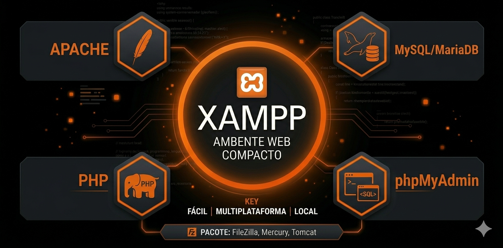

<h1 align=center>XAMPP</h1>

<h2 align=center>O XAMPP é uma estrutura integrada (framework de servidores) leve, baseada em código aberto, que ajuda desenvolvedores a criar ambientes locais para construir e testar aplicações web baseadas em PHP de forma rápida e produtiva</h2>

<b>OBJETIVOS</b>
 Gerenciar o ecossistema de desenvolvimento web, simular servidores reais na própria máquina, permitir testes locais eficientes e garantir o bom funcionamento do código PHP antes da publicação.

<h3 align=center>PRINCIPAIS COMPONENTES</h3>

<b>Apache: </b>É o servidor web principal do pacote. Ele atua recebendo as requisições enviadas pelo navegador do usuário, processando os arquivos necessários e devolvendo as páginas web renderizadas.

<b>PHP: </b>É a linguagem de programação de script executada no lado do servidor (backend). Ela processa a lógica de negócios da aplicação, interage diretamente com o banco de dados e gera o conteúdo dinâmico.

<b>MariaDB/MySQL: </b>É o sistema de gerenciamento de banco de dados (SGBD). Sua função é armazenar, estruturar, proteger e gerenciar de forma organizada todas as informações cruciais do sistema web.

<b>phpMyAdmin: </b>É uma interface gráfica baseada em web para administração do banco de dados. Ela simplifica o gerenciamento das tabelas e registros através de um visual intuitivo pelo navegador.

<h3 align=center>FLUXO DE INSTALAÇÃO E CONFIGURAÇÃO</h3>

<b>Download e execução: </b> Download do instalador oficial direto no site da Apache Friends e execução do assistente visual padrão (Next, Next, Finish) com as permissões corretas.

<b>Painel de controle: </b>Inicialização dos módulos do Apache e do MySQL através dos botões "Start" no XAMPP Control Panel para ativar o servidor local.

<b>Diretório de projetos: </b>Alocação obrigatória de todos os códigos-fonte da sua aplicação PHP dentro da pasta de destino do servidor local, localizada no diretório htdocs.

<b>Acesso no navegador: </b>Execução e teste da aplicação digitando a URL local localhost/seu-projeto/ no navegador, ou localhost/phpmyadmin/ para mexer no banco de dados.

<h3 align=center>BENEFÍCIOS DO USO DO XAMPP EM PROJETOS</h3>

<b>Segurança isolada: </b>Permite testar códigos, simular falhas graves e corrigir bugs em uma máquina isolada, sem colocar dados reais em risco.

<b>Agilidade no desenvolvimento: </b>Foco em mudanças dinâmicas instantâneas, onde qualquer alteração no código PHP é vista imediatamente ao atualizar a página local.

<b>Independência de conexão: </b>O ecossistema web roda 100% de maneira offline no hardware local, permitindo o trabalho contínuo mesmo sem acesso à internet.

<b>Simulação fiel da nuvem: </b>Recria com alta precisão o comportamento operacional idêntico ao que o software terá quando for hospedado em um servidor web definitivo.

